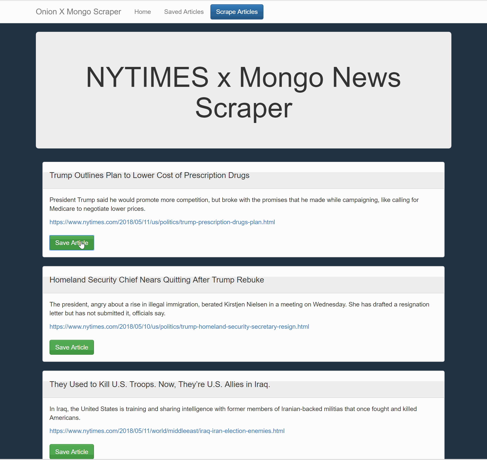

# mongoScraper
Bootcamp Assignnment: Web app that lets users view and leave comments on the latest news.

# I am not Cambridge Analytica, but I know basically how that whole thing worked...  

  User can scrape articles from NYTIMES.

# Current State...  
Some things are not working - like heroku deployment.  Working on that still.  But the routing/basic ideas are all here now:

